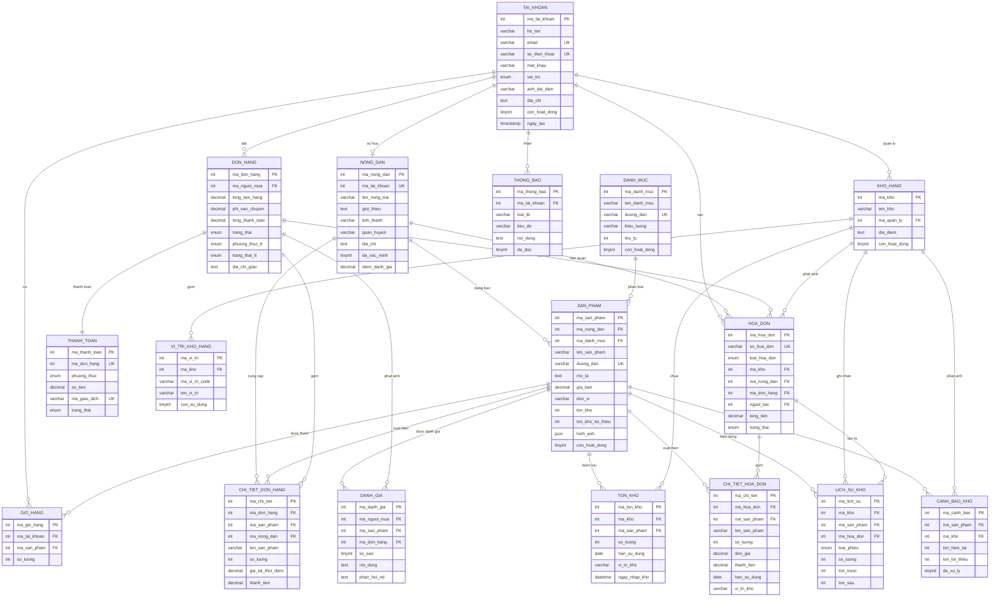

```mermaid
erDiagram
    TAI_KHOAN {
        int ma_tai_khoan PK
        varchar ho_ten
        varchar email UK
        varchar so_dien_thoai UK
        varchar mat_khau
        enum vai_tro
        varchar anh_dai_dien
        text dia_chi
        tinyint con_hoat_dong
        timestamp ngay_tao
    }

    NONG_DAN {
        int ma_nong_dan PK
        int ma_tai_khoan UK
        varchar ten_nong_trai
        text gioi_thieu
        varchar tinh_thanh
        varchar quan_huyen
        text dia_chi
        tinyint da_xac_minh
        decimal diem_danh_gia
    }

    DANH_MUC {
        int ma_danh_muc PK
        varchar ten_danh_muc
        varchar duong_dan UK
        varchar bieu_tuong
        int thu_tu
        tinyint con_hoat_dong
    }

    SAN_PHAM {
        int ma_san_pham PK
        int ma_nong_dan FK
        int ma_danh_muc FK
        varchar ten_san_pham
        varchar duong_dan UK
        text mo_ta
        decimal gia_ban
        varchar don_vi
        int ton_kho
        int ton_kho_toi_thieu
        json hinh_anh
        tinyint con_hoat_dong
    }

    GIO_HANG {
        int ma_gio_hang PK
        int ma_tai_khoan FK
        int ma_san_pham FK
        int so_luong
    }

    DON_HANG {
        int ma_don_hang PK
        int ma_nguoi_mua FK
        decimal tong_tien_hang
        decimal phi_van_chuyen
        decimal tong_thanh_toan
        enum trang_thai
        enum phuong_thuc_tt
        enum trang_thai_tt
        text dia_chi_giao
    }

    CHI_TIET_DON_HANG {
        int ma_chi_tiet PK
        int ma_don_hang FK
        int ma_san_pham FK
        int ma_nong_dan FK
        varchar ten_san_pham
        int so_luong
        decimal gia_tai_thoi_diem
        decimal thanh_tien
    }

    DANH_GIA {
        int ma_danh_gia PK
        int ma_nguoi_mua FK
        int ma_san_pham FK
        int ma_don_hang FK
        tinyint so_sao
        text noi_dung
        text phan_hoi_nd
    }

    THANH_TOAN {
        int ma_thanh_toan PK
        int ma_don_hang UK
        enum phuong_thuc
        decimal so_tien
        varchar ma_giao_dich UK
        enum trang_thai
    }

    THONG_BAO {
        int ma_thong_bao PK
        int ma_tai_khoan FK
        varchar loai_tb
        varchar tieu_de
        text noi_dung
        tinyint da_doc
    }

    KHO_HANG {
        int ma_kho PK
        varchar ten_kho
        int ma_quan_ly FK
        text dia_diem
        tinyint con_hoat_dong
    }

    VI_TRI_KHO_HANG {
        int ma_vi_tri PK
        int ma_kho FK
        varchar ma_vi_tri_code
        varchar ten_vi_tri
        tinyint con_su_dung
    }

    TON_KHO {
        int ma_ton_kho PK
        int ma_kho FK
        int ma_san_pham FK
        int so_luong
        date han_su_dung
        varchar vi_tri_kho
        datetime ngay_nhap_kho
    }

    HOA_DON {
        int ma_hoa_don PK
        varchar so_hoa_don UK
        enum loai_hoa_don
        int ma_kho FK
        int ma_nong_dan FK
        int ma_don_hang FK
        int nguoi_tao FK
        decimal tong_tien
        enum trang_thai
    }

    CHI_TIET_HOA_DON {
        int ma_chi_tiet PK
        int ma_hoa_don FK
        int ma_san_pham FK
        varchar ten_san_pham
        int so_luong
        decimal don_gia
        decimal thanh_tien
        date han_su_dung
        varchar vi_tri_kho
    }

    LICH_SU_KHO {
        int ma_lich_su PK
        int ma_kho FK
        int ma_san_pham FK
        int ma_hoa_don FK
        enum loai_phieu
        int so_luong
        int ton_truoc
        int ton_sau
    }

    CANH_BAO_KHO {
        int ma_canh_bao PK
        int ma_san_pham FK
        int ma_kho FK
        int ton_hien_tai
        int ton_toi_thieu
        tinyint da_xu_ly
    }

    TAI_KHOAN ||--o| NONG_DAN : "so huu"
    TAI_KHOAN ||--o{ GIO_HANG : "co"
    TAI_KHOAN ||--o{ DON_HANG : "dat"
    TAI_KHOAN ||--o{ THONG_BAO : "nhan"
    TAI_KHOAN ||--o{ KHO_HANG : "quan ly"
    TAI_KHOAN ||--o{ HOA_DON : "tao"

    NONG_DAN ||--o{ SAN_PHAM : "dang ban"
    NONG_DAN ||--o{ CHI_TIET_DON_HANG : "cung cap"
    NONG_DAN ||--o{ HOA_DON : "lien quan"

    DANH_MUC ||--o{ SAN_PHAM : "phan loai"
    SAN_PHAM ||--o{ GIO_HANG : "duoc them"
    SAN_PHAM ||--o{ CHI_TIET_DON_HANG : "xuat hien"
    SAN_PHAM ||--o{ DANH_GIA : "duoc danh gia"
    SAN_PHAM ||--o{ TON_KHO : "duoc luu"
    SAN_PHAM ||--o{ CHI_TIET_HOA_DON : "xuat hien"
    SAN_PHAM ||--o{ LICH_SU_KHO : "bien dong"
    SAN_PHAM ||--o{ CANH_BAO_KHO : "canh bao"

    DON_HANG ||--o{ CHI_TIET_DON_HANG : "gom"
    DON_HANG ||--|| THANH_TOAN : "thanh toan"
    DON_HANG ||--o{ DANH_GIA : "phat sinh"
    DON_HANG ||--o{ HOA_DON : "lien ket"

    KHO_HANG ||--o{ VI_TRI_KHO_HANG : "gom"
    KHO_HANG ||--o{ TON_KHO : "chua"
    KHO_HANG ||--o{ HOA_DON : "phat sinh"
    KHO_HANG ||--o{ LICH_SU_KHO : "ghi nhan"
    KHO_HANG ||--o{ CANH_BAO_KHO : "phat sinh"

    HOA_DON ||--o{ CHI_TIET_HOA_DON : "gom"
    HOA_DON ||--o{ LICH_SU_KHO : "tao ra"
```
