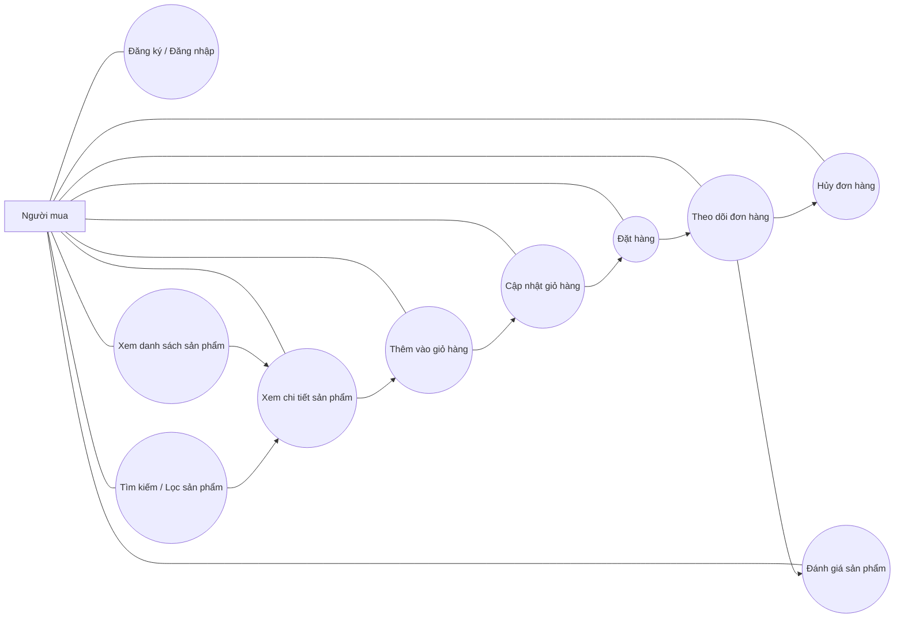

```mermaid
flowchart LR
    A["Người mua"] --- UC1(("Đăng ký / Đăng nhập"))
    A --- UC2(("Xem danh sách sản phẩm"))
    A --- UC3(("Tìm kiếm / Lọc sản phẩm"))
    A --- UC4(("Xem chi tiết sản phẩm"))
    A --- UC5(("Thêm vào giỏ hàng"))
    A --- UC6(("Cập nhật giỏ hàng"))
    A --- UC7(("Đặt hàng"))
    A --- UC8(("Theo dõi đơn hàng"))
    A --- UC9(("Hủy đơn hàng"))
    A --- UC10(("Đánh giá sản phẩm"))

    UC2 --> UC4
    UC3 --> UC4
    UC4 --> UC5
    UC5 --> UC6
    UC6 --> UC7
    UC7 --> UC8
    UC8 --> UC9
    UC8 --> UC10
```
