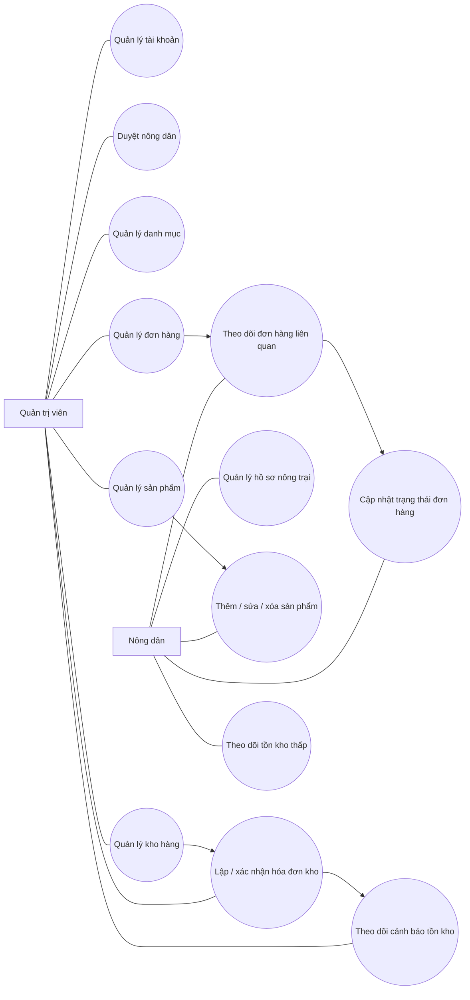

```mermaid
flowchart LR
    A["Quản trị viên"] --- AD1(("Quản lý tài khoản"))
    A --- AD2(("Duyệt nông dân"))
    A --- AD3(("Quản lý danh mục"))
    A --- AD4(("Quản lý sản phẩm"))
    A --- AD5(("Quản lý đơn hàng"))
    A --- AD6(("Quản lý kho hàng"))
    A --- AD7(("Lập / xác nhận hóa đơn kho"))
    A --- AD8(("Theo dõi cảnh báo tồn kho"))

    B["Nông dân"] --- F1(("Quản lý hồ sơ nông trại"))
    B --- F2(("Thêm / sửa / xóa sản phẩm"))
    B --- F3(("Theo dõi đơn hàng liên quan"))
    B --- F4(("Cập nhật trạng thái đơn hàng"))
    B --- F5(("Theo dõi tồn kho thấp"))

    AD4 --> F2
    AD5 --> F3
    AD6 --> AD7
    AD7 --> AD8
    F3 --> F4
```
